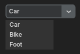
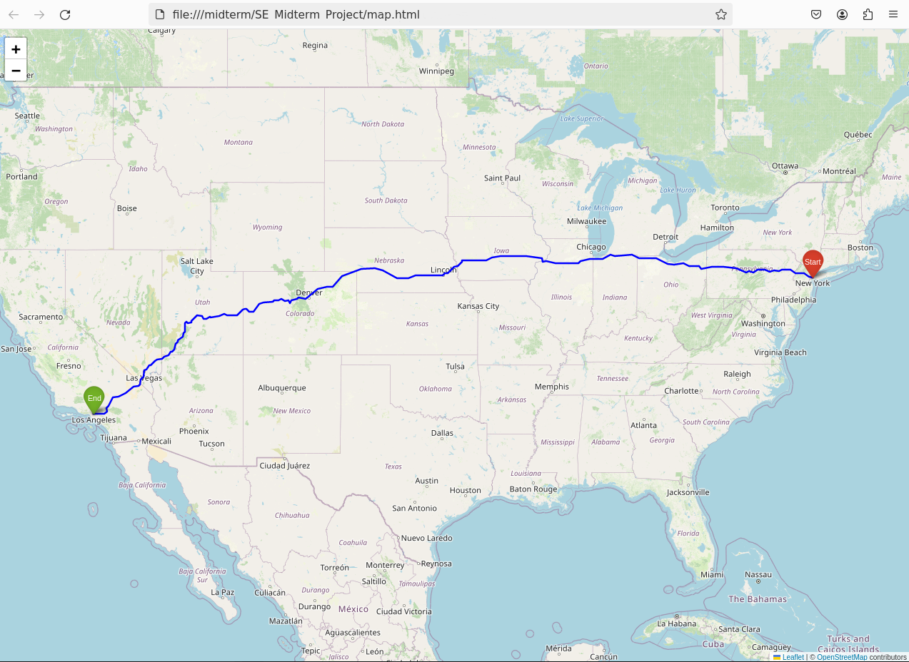
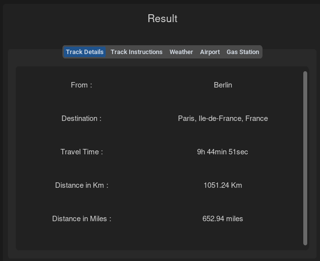
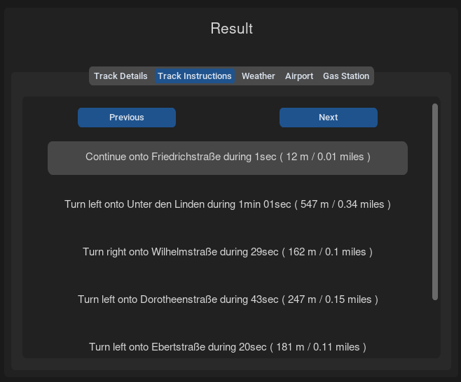
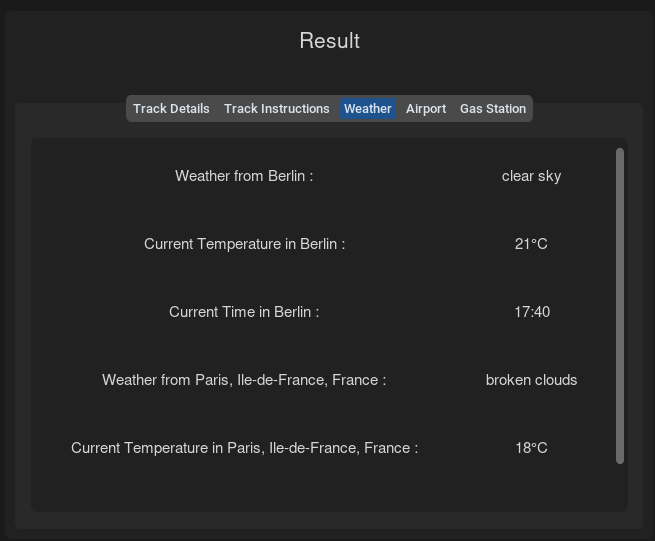
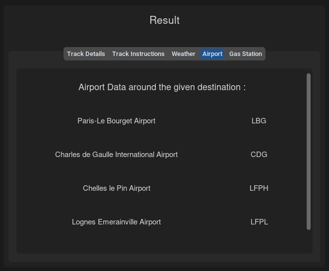
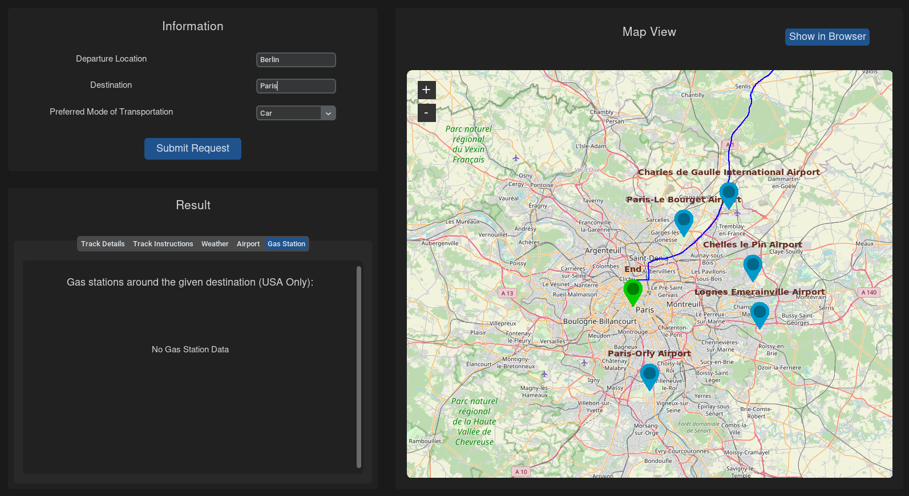
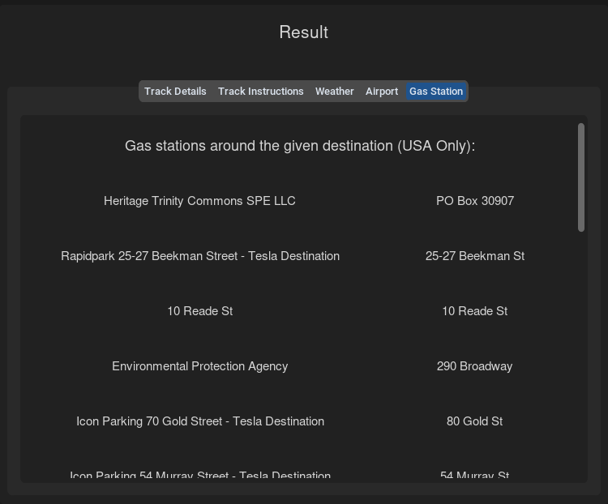
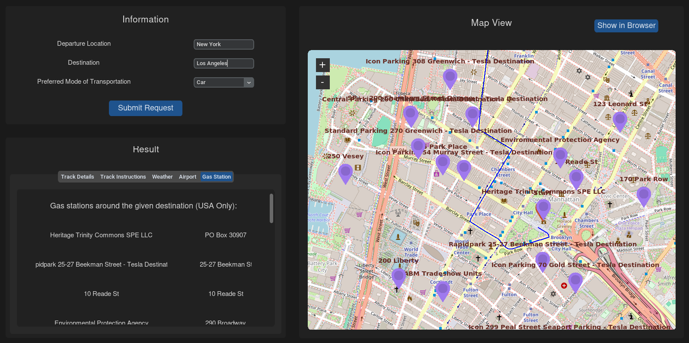

# MidTerm : Option 1: Feature enhancements of the Lab 4.9.2 code by adding user-friendly features to the MapQuest REST API

## Setup

To use our python application you must first have installed python3

Then you have to install with the package manager of python (pip) these packages :
```shell
pip install tkintermapview
pip install tk
pip install --upgrade Pillow
pip install folium
pip install polyline
pip install pytz
pip install timezonefinder
```

To install pip : 
```shell
sudo apt install python3-pip
```

# Used APIs

- <a href="https://www.graphhopper.com/" target="_blank">Graphhopper</a> : Used to obtain the path, time and distance from two points
- <a href="https://api-ninjas.com/" target="_blank">API Ninjas</a> : Get the airports location
- <a href="https://openweathermap.org/api/" target="_blank">OpenWeatherMap API</a> : Get the current weather
- <a href="https://developer.nrel.gov/docs/transportation/alt-fuel-stations-v1/nearest/" target="_blank">Developer Network API</a> : Get information about gas station in U.S


# Demonstration

To lauch the application :
```shell
python3 main.py
```

Global view:

https://github.com/AdrienCapitaine/SE_Midterm_Project/assets/94189644/4960acf4-96dd-4e90-bfa0-8ba06b3680ee

<a href="https://www.youtube.com/watch?v=C9FWHAJ370c&ab_channel=ProjectSoftwareINHA" target="_blank">Presentation video in better quality</a>

The application is divided into 3 sections: 
- First, the top left-hand section is used to enter the point of departure, destination and means of transport (car, bike or on foot).

	

- The section on the right is a dynamic map that is updated as soon as data is submitted. It will display the main points such as destinations and arrival points as well as the route between these points and airports/gas stations if there are any nearby.

  In this section, you'll also find the "show in browser" button, which opens the map with arrival and departure points, as well as the route, in a full-screen window in the browser, which can be more ergonomic.

  

- The last section on the bottom left is a summary of all the data collected thanks to the APIs.
	- First, the "Track details" tab displays details such as journey time (which depends on the means of transport), distance in miles and in kilometers.

	
 
	- Secondly, the "Track Instructions" tab, which displays directions to follow. It is possible to move on to the next one with the next button, or to the previous one with the previous button.
   
	

	- The third tab, called weather, gives the weather, temperature and local time for destination and arrival points.
   
	
 
	- The fourth tab provides information on airports in the area of the destination. The airports found will also be displayed on the dynamic map with blue markers.
   
	 
 
	- Finally, the last tab (only available in the U.S.) lists a few gas stations along the route. These points will also be displayed on the dynamic map with purple markers.
   

 	  


> You can find the presentation file at the source folder : SE_API_Project.pptx
